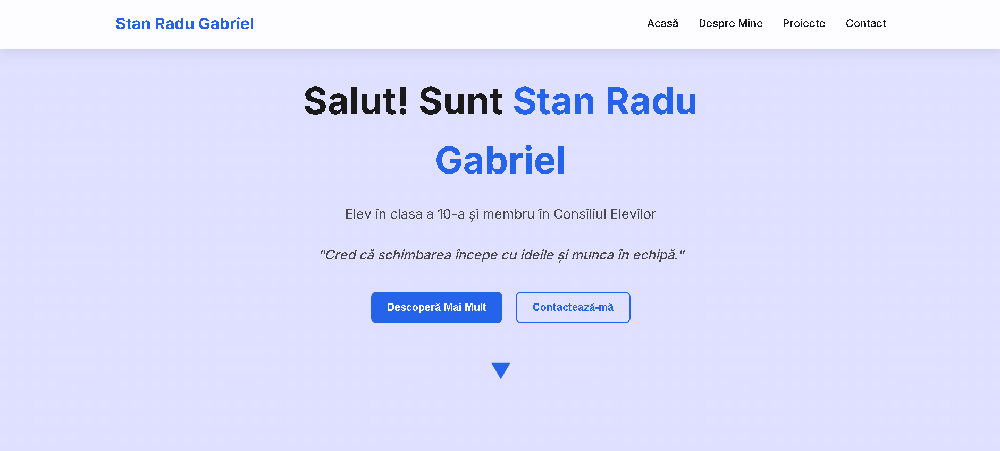

# 🌟 Stan Radu Gabriel - Personal Portfolio Website 🌟



Hello! 👋 I'm Stan Radu Gabriel, a passionate 10th-grade student and dedicated member of the Student Council at "Ștefan cel Mare" National College in Romania. This website was created by Ioniță Aurel-Mihai. This website is my personal portfolio project, showcasing my journey as a student leader committed to improving our school community through innovative initiatives and collaborative projects. Discover the impact we're making together! 🌟

## 📖 About the Project

This responsive personal website serves as a comprehensive digital portfolio featuring:
- 🏠 **Hero Section**: Engaging introduction with call-to-action buttons
- 👤 **About Me**: Detailed personal story, Student Council involvement, and downloadable CV
- 🚀 **Projects & Initiatives**: Showcase of key school projects including Eco Creații (eco-awareness), Ornarea Claselor (classroom decoration for National Day), and Balul Bobocilor (freshmen ball event)
- 📞 **Contact Section**: Multiple ways to connect via email, social media, and direct messaging
- 📱 **Responsive Design**: Optimized for desktop, tablet, and mobile devices
- 🎨 **Modern UI/UX**: Clean, professional design with smooth animations and interactive elements

## 🌐 Live Demo

Experience the website in action: [https://iam269.github.io/Stan-Radu-Gabriel/](https://iam269.github.io/Stan-Radu-Gabriel/)

## 🛠️ Technology Stack

- **Frontend**: React, TypeScript, Vite
- **Styling**: Custom CSS with modern design principles
- **Fonts**: Google Fonts (Inter family)
- **Icons**: Custom PNG icons and Unicode emojis
- **Deployment**: GitHub Pages

## 📁 Project Architecture

```
stan-radu-gabriel/
├── public/
│   ├── assets/         # Media resources
│   │   ├── CV/         # Curriculum Vitae
│   │   ├── profile/    # Profile images
│   │   └── projects/   # Project showcase images
│   └── icons/          # Social media icons
├── src/
│   ├── components/     # React components
│   │   ├── App.tsx
│   │   ├── Hero.tsx
│   │   ├── About.tsx
│   │   ├── Projects.tsx
│   │   ├── AllProjects.tsx
│   │   ├── Contact.tsx
│   │   ├── Footer.tsx
│   │   └── Navbar.tsx
│   ├── styles.css      # Comprehensive styling
│   ├── main.tsx        # Entry point
│   └── vite-env.d.ts
├── index.html          # Main HTML structure
├── package.json
├── vite.config.js
└── tsconfig.json
```

## ✨ Key Features

- **Smooth Scrolling Navigation**: Single-page application with section-based navigation
- **Image Carousel**: Interactive project galleries with navigation buttons
- **Modal Windows**: CV viewer with overlay functionality
- **Mobile-First Design**: Responsive layout adapting to all screen sizes
- **Accessibility**: Semantic HTML and ARIA labels for better usability
- **Performance Optimized**: Fast loading with optimized assets

## 🎯 Project Goals

- Showcase personal growth and leadership in student governance
- Highlight community impact through Student Council initiatives
- Provide easy access to contact information for collaboration
- Demonstrate web development skills in a real-world project
- Create a professional online presence for networking opportunities

## 📧 Get In Touch

I'm always excited to connect and collaborate on new initiatives!

- **Email**: [raduq.stan@gmail.com](mailto:raduq.stan@gmail.com)
- **Instagram**: [@raduq.st](https://www.instagram.com/raduq.st/)
- **Facebook**: [Radu Gabriel Stan](https://www.facebook.com/profile.php?id=100068926080795&locale=ro_RO)

## 🚀 Future Enhancements

- [ ] Add blog section for project updates
- [ ] Implement contact form with backend integration
- [ ] Add dark mode toggle
- [ ] Include testimonials from collaborators
- [ ] Add analytics tracking

---

*"Leadership means action, not position."* 🌟

*Together, we can make a difference in our school community and beyond!* 🚀